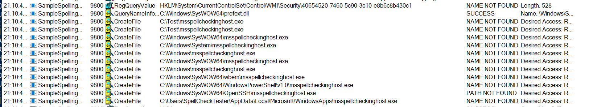
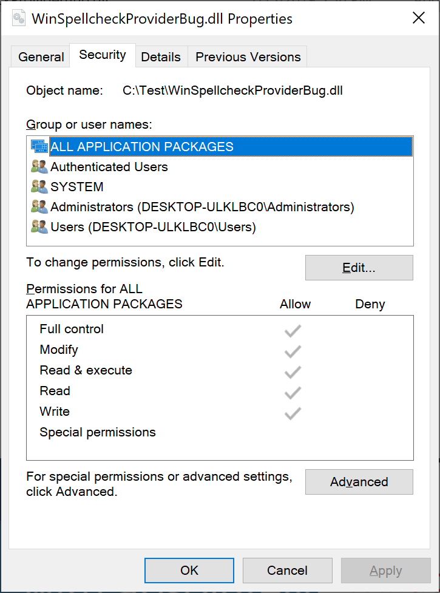

# Windows Spellchecking API bug MWE


## Description


When application tries to use any function of `ISpellCheckFactory` interface, it 

* application loads `MsSpellCheckingFacility.dll`
* `MsSpellCheckingFacility.dll` tries to launch `MsSpellCheckingHost.exe` in case if it was not loaded previously
* In case of 32-bit apps, it performs search in `SysWow64` instead of `System32`. Unfortunately, there is only 64-bit version on 64-bit Windows, so it always fails.




https://docs.microsoft.com/en-us/windows/win32/api/spellcheck/nn-spellcheck-ispellcheckerfactory

## Steps to reproduce

1. Compile `SpellCheckBug_MinimalWorkingExample.sln` in both `x86` and `x64` configurations

2. Place content of `<repo_root>\output\` in `C:\test\` folder

3. Grant all permissions to ALL for `C:\test\SampleSpellCheckProvider_64.dll` file



4. Apply `<repo_root>\SpellCheckBug_register.reg` file

5. Kill `MsSpellCheckingHost.exe` if it exists

6. Run `C:\test\SampleSpellingClient_64.exe`

7. You will see 
```
Available languages:
be
be-BY
en-CA
en-LR
en-PH
en-US
ru-MO
ru-RU
```

`be` and `be-BY` were added by `SampleSpellCheckProvider_64.dll`

8. Kill `MsSpellCheckingHost.exe` if it exists

9. Run `C:\test\SampleSpellingClient_32.exe`

10. You will see 
```
Available languages:
en-CA
en-LR
en-PH
en-US
ru-MO
ru-RU
```

`be` and `be-BY` disappears because MsSpellCheckingHost.exe were not found.

11. Copy `C:\Windows\System32\MsSpellCheckingHost.exe` to `C:\Test`

12. Kill `MsSpellCheckingHost.exe` if it exists

13. Run `C:\test\SampleSpellingClient_32.exe`

14. You will see 
```
Available languages:
be
be-BY
en-CA
en-LR
en-PH
en-US
ru-MO
ru-RU
```

because `MsSpellCheckingHost.exe` was successfully loaded.
